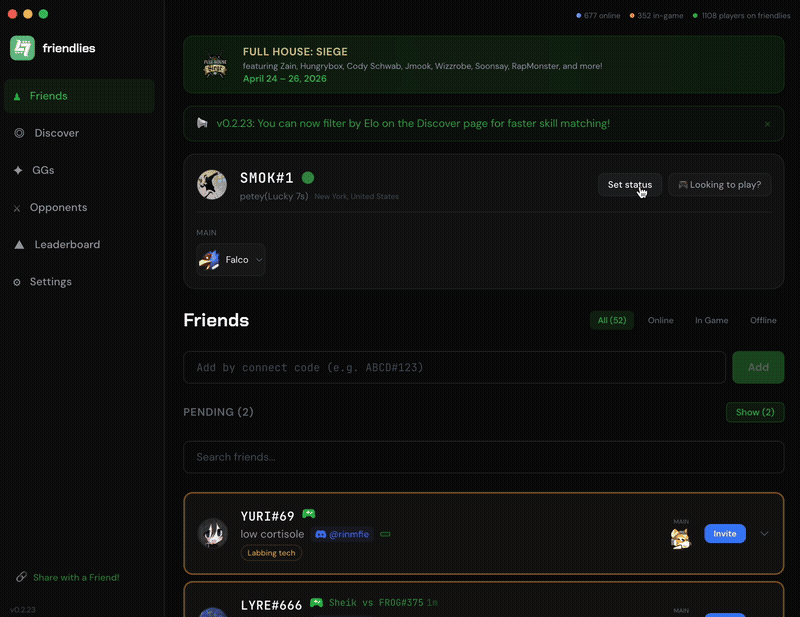

  

<h1 align="center">friendlies</h1>

  a friends list for melee — see who's online, manage your friend list, and find new practice partners!

  <a href="https://luckystats.gg/friendlies"><strong>luckystats.gg/friendlies</strong></a>

---

  

---

### How it works

1. **Install friendlies** — Download the app and run it.
2. **Sync with Discord** — Sign in to link your Slippi tag.
3. **Play!** — See who's online and start playing.

### Features

- Live online/in-game status for your friends list
- Add friends by Slippi connect code
- Desktop notifications when friends come online
- Opponent history from your replays
- Works on Windows, macOS, and Linux

### Downloads

Grab the latest release for your platform from the [releases page](https://github.com/0xburn/friendlies/releases/latest) or visit **[luckystats.gg/friendlies](https://luckystats.gg/friendlies)**.

---

  Open source. Not affiliated with Slippi or Nintendo.

